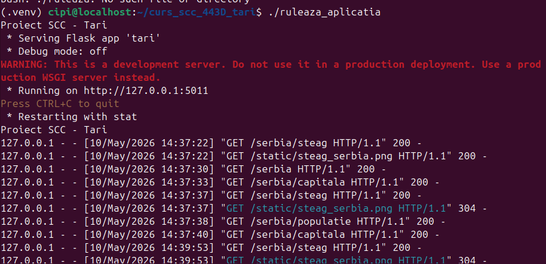
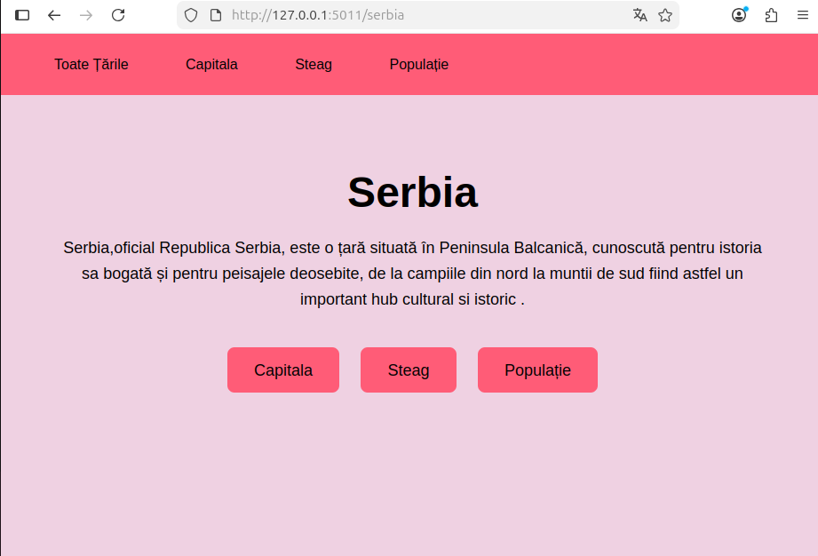
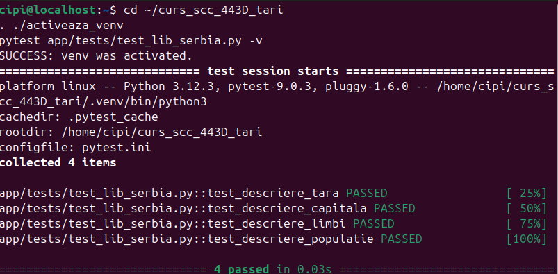
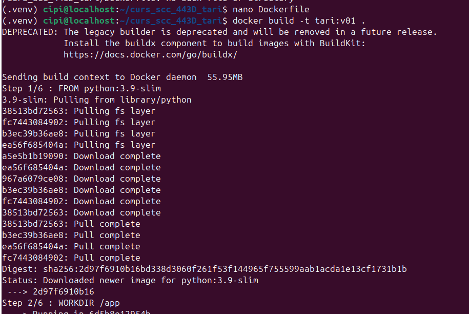
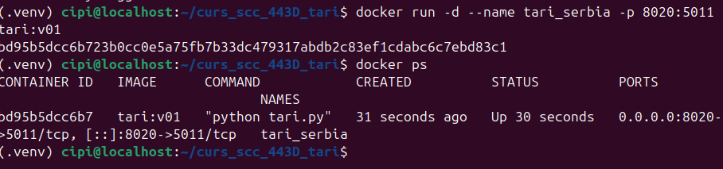
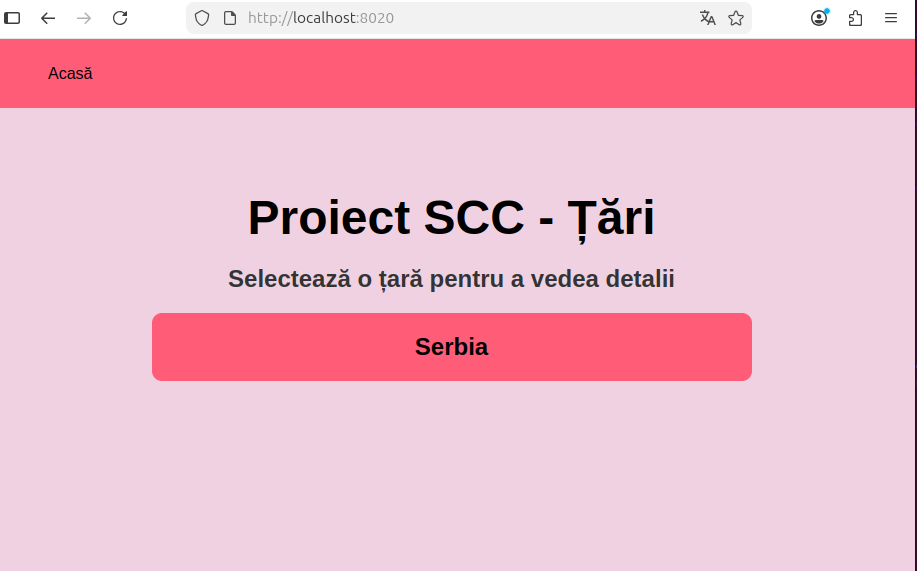
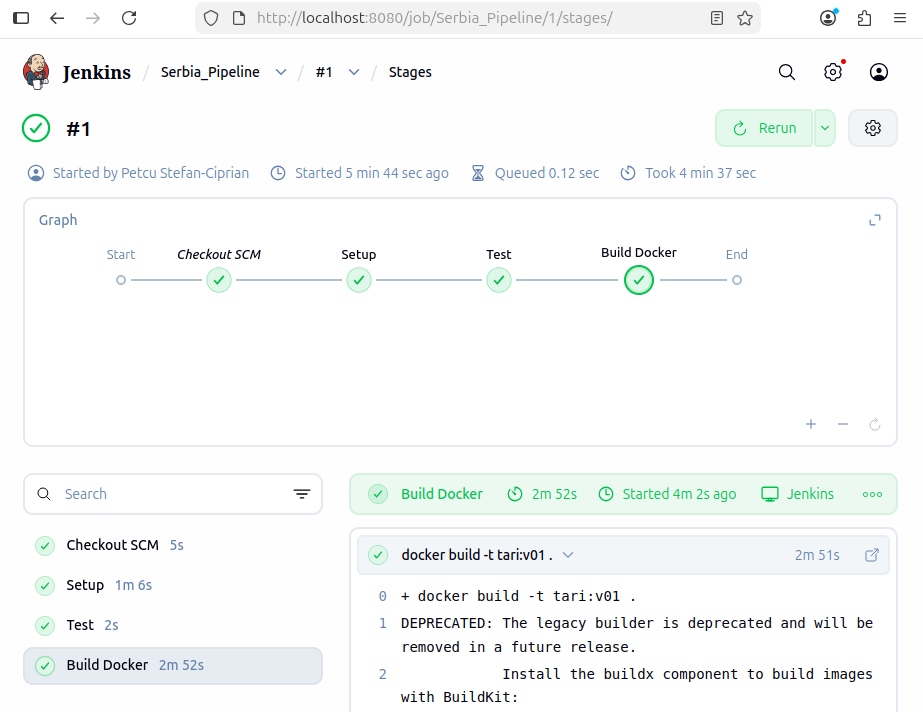

# Proiect SCC - Țări

## Dezvoltator
- **Nume:** Petcu Ștefan-Ciprian
- **Grupa:** 443D
- **Țară alocată:** Serbia

## Cuprins
- [Descriere generală](#descriere-generală)
- [Funcționalitate implementată](#funcționalitate-implementată)
- [Stadiu dezvoltare](#stadiu-dezvoltare)
- [Testare manuală în browser](#testare-manuală-în-browser)
- [Testare automată cu pytest](#testare-automată-cu-pytest)
- [Testare cu Docker](#testare-cu-docker)
- [DevOps CI](#devops-ci)
  - [Exemplu executie pipeline Jenkins](#exemplu-executie-pipeline-jenkins)
- [Concluzii](#concluzii)
- [Bibliografie](#bibliografie)

## Descriere generală
[cuprins](#cuprins)

Acest proiect se înscrie în tema comună a grupei 443D, „Țări”, scopul modulului fiind dezvoltarea și integrarea unui set de funcționalități dedicate țării **Serbia**.
 
Aplicația la bază este implementată utilizând framework-ul web Flask, fiind proiectată pentru a furniza date esențiale și formatate despre țara accesată. În vederea respectării practicilor moderne de inginerie software (DevOps), soluția a fost supusă testării automate (Pytest), containerizată prin intermediul Docker și orchestrată într-un pipeline de integrare continuă (CI/CD) folosind Jenkins.

## Funcționalitate implementată
[cuprins](#cuprins)

În acest branch am adăugat și personalizat:

- Fișierul `app/lib/biblioteca_serbia.py` cu funcțiile:
  - `descriere_capitala()` – returnează capitala Serbiei (Belgrad).
  - `descriere_steag()` – returnează codul HTML pentru afișarea steagului Serbiei.
  - `descriere_tara()` – oferă o descriere generală a țării.
  - `descriere_limbi()` – afișează limba oficială (sârba).
  - `descriere_populatie()` – afișează numărul de locuitori.

- Integrarea în fișierul de configurare globală `app/lib/biblioteca_tari.py`:
  - Declararea țării în dicționarul global `TARI`.
  - Maparea modulului aferent în dicționarul `BIBLIOTECI`.
  - Această configurare permite fișierului principal de rutare (`tari.py`) să expună dinamic următoarele endpoint-uri pentru Serbia, respectând tiparul arhitectural al proiectului:
    - `/serbia` – pagina principală a țării.
    - `/serbia/capitala` – date despre capitală.
    - `/serbia/populatie` – date demografice.
    - `/serbia/steag` – reprezentarea grafică a drapelului.

- Fișierul `app/tests/test_lib_serbia.py` care conține testele automate pentru funcțiile definite.

## Stadiu dezvoltare
[cuprins](#cuprins)

- Funcționalitate complet implementată.
- Cod adăugat în branch-ul de lucru `dev_petcu_stefan`.
- Dockerfile și Jenkinsfile sunt funcționale, urmând pipeline-ul de CI/CD.
- Testare locală, automată și containerizată realizată cu succes.

## Testare manuală în browser
[cuprins](#cuprins)

Clonarea repository-ului și selectarea ramurii de dezvoltare pentru 'Serbia':

```bash
mkdir scc
cd scc
git clone https://github.com/petcuciprian2003-alt/curs_scc_443D_tari.git
cd curs_scc_443D_tari
git checkout dev_petcu_stefan

Se activează mediul virtual și se pornește aplicația cu scripturile bash existente (din rădăcina proiectului):
bash

. ./activeaza_venv
./ruleaza_aplicatia

Daca apar erori de permisiuni se introduce comanda:
bash

sudo chmod 764 ./activeaza_venv ./ruleaza_aplicatia

Aplicația poate fi accesată în browser la adresa:
text

http://127.0.0.1:5011/serbia



De asemenea, se pot verifica următoarele rute:

    /serbia

    /serbia/capitala

    /serbia/populatie

    /serbia/steag


Testare automată cu pytest

cuprins

Testele au fost scrise în fișierul app/tests/test_lib_serbia.py. Cu mediul virtual activ, rularea testelor se face astfel:
bash

pytest app/tests/test_lib_serbia.py -v

Toate testele au fost executate cu succes, validând corectitudinea funcțiilor definite.


Testare cu Docker

cuprins

Pentru asigurarea portabilității aplicației, am creat un container Docker. Pașii efectuați au fost:

    Construirea imaginii:

bash

docker build -t tari:v01 .



    Rularea containerului:

bash

docker run -d --name tari_serbia -p 8020:5000 tari:v01



    Accesarea aplicației în browser:

text

http://localhost:8020/serbia


DevOps CI

cuprins

    CI = Continuous Integration (Integrare Continuă)

Proiectul utilizează un flux de automatizare definit în Jenkinsfile, care asigură validarea codului și livrarea aplicației.
Exemplu executie pipeline Jenkins

Etapele Pipeline-ului:

    Setup: Crearea mediului virtual și instalarea dependințelor.

    Test: Rularea testelor cu pytest (4/4 PASSED).

    Build Docker: Construirea imaginii Docker și pornirea containerului pe portul 8020.

Se creează pipeline-ul în Jenkins, care este accesat local pe portul 8080 și se conectează cu repository-ul.
Odată creat, se verifică funcționalitatea cu Build Now, urmat de confirmarea execuției cu succes în Console Output (log-uri).


Concluzii

cuprins

Acest proiect atinge cu succes atât obiectivele funcționale, cât și pe cele tehnice, evidențiind următoarele aspecte:

    Dezvoltare modulară: Implementarea unei aplicații web folosind framework-ul Flask, integrând bune practici de inginerie software.

    Arhitectură extensibilă: Integrarea datelor pentru Serbia a confirmat fiabilitatea separării datelor în biblioteci individuale și agregarea lor dinamică.

    Portabilitate: Containerizarea prin Docker a asigurat un mediu de rulare izolată, rapidă și consistentă pe diverse platforme.

    Automatizare (CI/CD): Pipeline-ul configurat în Jenkins a optimizat procesul de dezvoltare prin integrare și livrare continuă.

    Asigurarea calității: Testarea automată cu pytest a garantat stabilitatea aplicației la fiecare modificare a codului sursă.

Bibliografie

cuprins

https://github.com/crchende/sysinfo.git
https://github.com/raduionutgavrila/curs_scc_443D_tari
